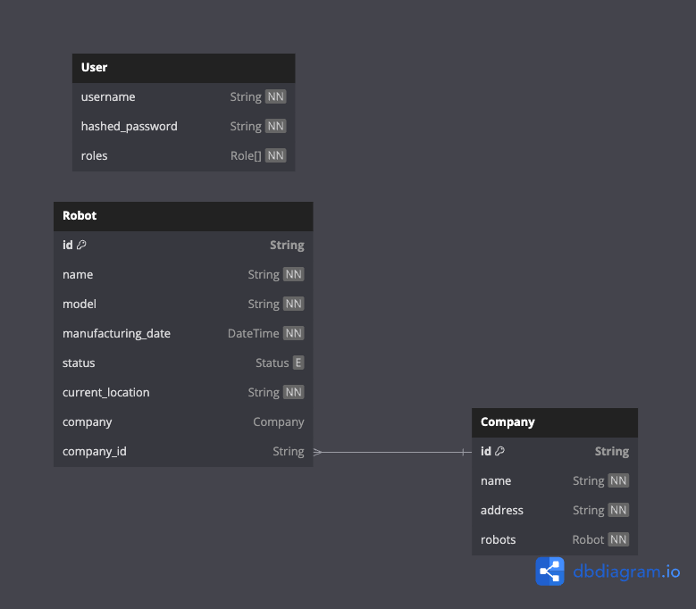

# Robot Management System

## Introduction

Welcome to the Robot Management System! This backend system streamlines the management of robots and companies, providing various features for CRUD (Create, Read, Update, Delete) operations.

## User Authentication and Authorization

This system includes a user authentication mechanism using JSON Web Tokens (JWT). It supports two user roles: operators and administrators. Operators are granted permission for CRUD operations on robots, while administrators enjoy full access to the system.

## Robot Management

Our system features APIs that facilitate robot management. Each robot is equipped with the following attributes:

- **Robot ID**: A unique identifier for each robot.
- **Name**: The name of the robot.
- **Model**: The robot's model.
- **Manufacturing Date**: The date when the robot was manufactured.
- **Status**: The robot's status (active, inactive, maintenance).
- **Current Location**: The robot's current location.
- **Company Assignment**: Robots can be assigned to specific companies.

## Company Management

The system also includes APIs for efficient company management. Each company is defined by the following attributes:

- **Company ID**: A unique identifier for each company.
- **Name**: The company's name.
- **Address**: The physical address of the company.

## Get Started

- Running the application with `Docker Compose` is recommended to facilitate the setup of application server and database server.
- Make sure you have `docker` installed in your local machine.

Run:

```bash
docker compose build && docker compose up
```

## List of API endpoints:

- Visit `http://localhost:3000/api` for the list of API endpoints:

## API testing:

- Recommended: Install VScode extension https://marketplace.visualstudio.com/items?itemName=humao.rest-client to faciliate API testing with VSCode
- Open up `rest.http` file and run the request in VSCode.
- Alternatively you may use other API client for testing.
- The credentials for mock API account can be found on `rest.http`.

## Database Design / ERD:


